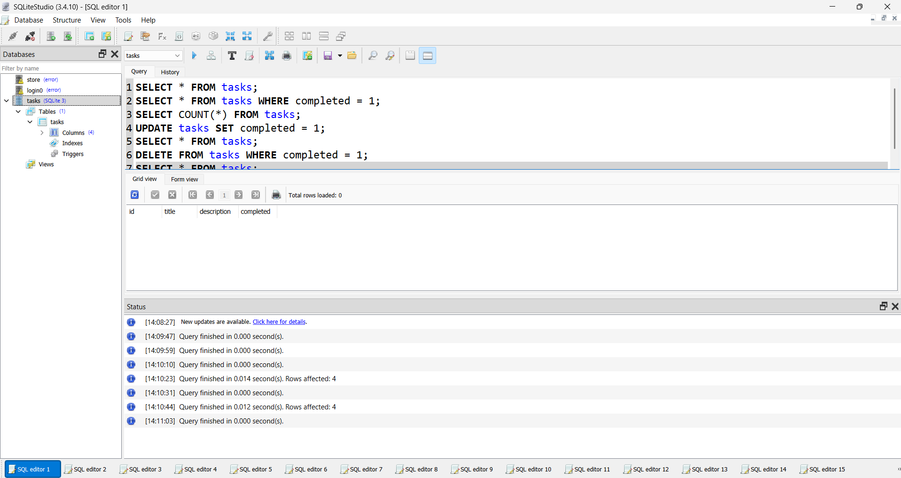

# FlyRank CRUD API

A simple To-Do REST API built with Python and FastAPI for the FlyRank Backend AI Engineer program.

The project was initially built using in-memory storage and was later upgraded to use a persistent SQLite database.

## Features

* Create tasks
* Read all tasks
* Read an individual task
* Update tasks
* Delete tasks
* Request validation
* HTTP status code handling
* Interactive Swagger/OpenAPI documentation
* SQLite database persistence
* Automatic database and table creation
* Data survives server restarts

## Tech Stack

* Python 3.10+
* FastAPI
* Uvicorn
* Pydantic
* SQLite

## Database

This version of the API uses **SQLite** instead of storing tasks in an in-memory Python list.

SQLite was chosen because it is lightweight, requires no separate database server, and stores the complete database in a single file. This makes it suitable for a small CRUD application and easy to set up for development and testing.

The database file is:

```text
tasks.db
```

The application automatically creates the database if it does not exist.

It also automatically creates the `tasks` table:

| Column        | Type    | Description                                 |
| ------------- | ------- | ------------------------------------------- |
| `id`          | INTEGER | Unique task identifier                      |
| `title`       | TEXT    | Task title                                  |
| `description` | TEXT    | Task description                            |
| `completed`   | INTEGER | Completion status (`0` = false, `1` = true) |

The `tasks.db` file is included in `.gitignore`, so the local database is not committed to GitHub.

When the project is cloned and started, the database and table are automatically created.

## API Endpoints

| Method | Endpoint      | Description             |
| ------ | ------------- | ----------------------- |
| GET    | `/`           | Welcome message         |
| GET    | `/health`     | Health check            |
| GET    | `/tasks`      | Get all tasks           |
| GET    | `/tasks/{id}` | Get a task by ID        |
| POST   | `/tasks`      | Create a new task       |
| PUT    | `/tasks/{id}` | Update an existing task |
| DELETE | `/tasks/{id}` | Delete a task           |

## Installation

Clone the repository:

```bash
git clone https://github.com/HuzaifaMuqeet/flyrank-w2-crud-api.git
cd flyrank-w2-crud-api
```

Create a virtual environment:

```powershell
python -m venv venv
```

Activate the virtual environment on Windows:

```powershell
venv\Scripts\activate
```

Install the dependencies:

```powershell
pip install -r requirment.txt
```

## Running the API

Start the FastAPI development server:

```powershell
uvicorn main:app --reload
```

The API will be available at:

```text
http://127.0.0.1:8000
```

Interactive Swagger/OpenAPI documentation is available at:

```text
http://127.0.0.1:8000/docs
```

## Example API Response

### GET `/tasks`

```json
[
  {
    "id": 1,
    "title": "Learn FastAPI",
    "description": "Build my first CRUD API",
    "completed": false
  },
  {
    "id": 2,
    "title": "Test API endpoints",
    "description": "Test the CRUD operations",
    "completed": false
  },
  {
    "id": 3,
    "title": "Complete documentation",
    "description": "Prepare the Week 2 submission",
    "completed": false
  }
]
```

## SQLite Testing

SQLiteStudio was used to inspect and modify the SQLite database manually.

The following SQL queries were executed as part of the database assignment.

List all tasks:

```sql
SELECT * FROM tasks;
```

Show completed tasks:

```sql
SELECT * FROM tasks WHERE completed = 1;
```

Count all tasks:

```sql
SELECT COUNT(*) FROM tasks;
```

Mark every task as completed:

```sql
UPDATE tasks SET completed = 1;
```

Delete all completed tasks:

```sql
DELETE FROM tasks WHERE completed = 1;
```

## Database Screenshot

The SQLite database was inspected using SQLiteStudio.



## Persistence

The original version of the project stored tasks in an in-memory Python list. This meant that all tasks were lost whenever the server restarted.

The updated implementation stores tasks in SQLite.

Therefore, tasks created through the API remain available after stopping and restarting the FastAPI server.

## Validation and Error Handling

The API returns appropriate HTTP status codes for different situations.

* `200 OK` — successful GET and PUT requests
* `201 Created` — successful task creation
* `204 No Content` — successful task deletion
* `400 Bad Request` — invalid request body
* `404 Not Found` — requested task does not exist

Example for an unknown task:

```json
{
  "detail": "Task not found"
}
```

## Assignment

**FlyRank Backend AI Engineering**

**Assignment:** BE-02 — Connecting to the Database

**Phase:** Foundations

**Week:** 3

The purpose of this assignment was to replace the in-memory task storage from the previous CRUD API with a persistent SQLite database while keeping the API endpoints and behavior consistent.
